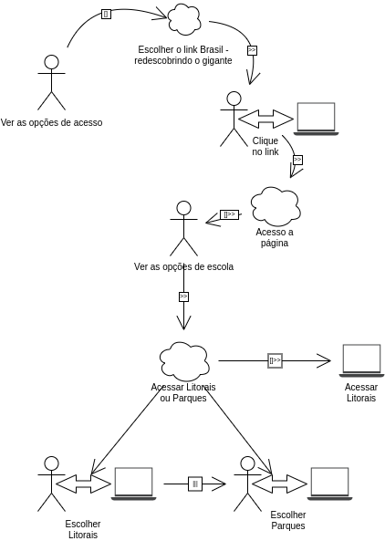

## 1 - Árvores de Tarefas Concorrentes (ConcurTaskTrees - CTT)

&emsp;&emsp; Esse modelo foi criado para ajudar a avaliação do design e a avaliação de IHC (Paterno, 1999). Existem quatro tipos de tarefa para esse modelo, que são elas:
- Tarefas do usuário: Realizadas fora do sistema
- Tarefas do sistema: O sistema realiza um processamento sem interagir com o usuário
- Tarefas interativas: Ocorre os diálogos usuário com o sistema
- Tarefas abstratas: Uma representação de uma composição de tarefas que auxilie a decomposição

Parecido com a análise hierárquica de tarefas, os diferentes níveis hierárquicos devem ser lidos como "para considerar T1 como tendo sido realizada, as tarefas T2 e T3 devem tersidos realizadas". Tanto as tarefas como a frase em aspas estão sendo representadas na figura 1.

Figura 2 - Exemplos de figuras representando as tarefas e suas comunicações entre si no modelo CTT

<small>
Figura 2 - Exemplos de figuras representando as tarefas e suas comunicações entre si no modelo CTT retirado do livro da Simone cap. 8
</small>

&emsp;&emsp;Além disso, o CTT permite representar diversas relações entre as tarefas e os significados dessas relações são:

- Ativação: Significa que a segunda tarefa só pode iniciar após a primeira tarefa terminar (T1 >> T2)
- Ativação com passagem de informação: Especifica que, além de T2 só poder ser iniciada após T1, a informação produzida por T1 é passada para T2 (T1 []>> T2)
- Escolha: Especifica duas tarefas que estejam habilitadas num momento, mas que, uma vez que uma delas é iniciada, a outra é desabilitada (T1 [] T2)
- Tarefas concorrentes: Especifica que as tarefas podem ser realizadas em qualquer ordem ou ao mesmo tempo (T1 ||| T2)
- Tarefas concorrentes e comunicantes: Especifica que, além de as tarefas poderem ser realizadas em qualquer ordem ou ao mesmo tempo, elas podem trocar informações (T1 |[]| T2)
- Tarefas independentes: Especifica que as tarefas podem ser realizadas em qualquer ordem, mas quando uma delas é iniciada, precisa terminar para que a outra possa ser iniciada (T1 |=| T2)
- Desativação: Especifica que T1 é completamente interrompida por T2 (T1 [> T2)
- Suspensão ou(e) retomada: Especifica que T1 pode ser interrompida por T2 e é retomada do ponto em que parou assim que T2 terminar (T1 |> T2)

  
A figura 2 apresenta um exemplo de cada uma das relações:

Figura 2 - Exemplos de figuras representando as relações entre as tarefas no modelo CTT

<small>
Figura 2 - Exemplos de figuras representando as relações entre as tarefas no modelo CTT retirado do livro da Simone cap. 8
</small>

Uma das vantagens do CTT é com relação a outros modelos de tarefas, é destacado a possibilidade do registro explícito das relações entre tarefas, entretanto com relação a modelos especificamentes projetados para a interação é a ausência de elementos destinados à representação de mecanismos de prevenção e tratamentos de erros na interação do usuário com o sistema. Na figura 3 está representada um exemplo de modelo CTT de análise de tarefa para um objetivo de marcar um compromisso em uma agenda, retirados do livro da Simone no cap.8 página 189.

Figura 3 - Exemplo de modelo CTT de análise de tarefa para um objetivo de marcar um compromisso em uma agenda

<small>
Figura 3 - Exemplo de modelo CTT de análise de tarefa para um objetivo de marcar um compromisso em uma agenda retirado do livro da Simone cap. 8
</small>

## 2 - Análise de desempenho do web site Brasil Channel com o CTT

&emsp;&emsp; Foi aplicado o modelo de análise de tarefas CTT, sendo o objetivo acessar a página Litoral.

&emsp;&emsp;Como no site avaliado as únicas funcionalidade que ele apresenta é acessar os links, a análise de tarefas CTT demonstra um pouco de dificuldade para obter informações importantes sobre as tarefas descritas. Pois para aplicações com diversas funcionalidade, o CTT seria melhor aplicado e o resultado satisfatório na hora de recolher os dados.  

&emsp;&emsp;Na figura 4 está o modelo CTT representando o objetivo de acessar o Litoral:

Figura 4 - Análise de tarefa CTT

<small>
Figura 4 - Modelo CTT seguindo o roteiro apresentado para o objetivo de acessar o Litoral
</small>

## Histórico de Versão

| Versão |                Alteração               | Responsável |         Revisor        |  Data |
|:------:|:--------------------------------------:|:-----------:|:----------------------:|:-----:|
|   1.0  | Criação do documento |    Levi Queiroz   |   | 20/07/2022 |
|   1.1  | Adição do CTT |   Levi Queiroz   |  | 20/07/2022 |

## Referências

- BARBOSA, Simone; DINIZ, Bruno. Interação Humano-Computador, Editora Elsevier, Rio de Janeiro, 2010.