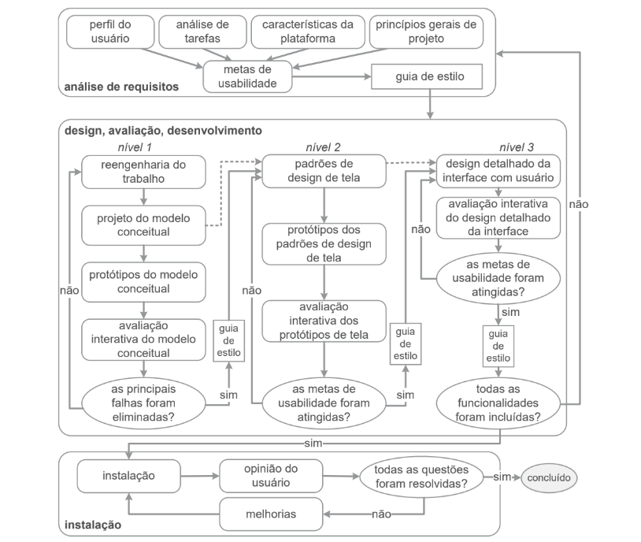

# Processo de Design

## 1. Introdução 

&emsp;&emsp; Uma característica básica dos processos de design de IHC é a execução das atividades de forma iterativa, permitindo refinamentos sucessivos da análise da situação atual e da proposta de intervenção. O design é um processo que envolve as seguintes atividades básicas: a análise da situação atual (identificação do problema), a síntese de uma intervenção e a avaliação dessa intervenção projetada ou já aplicada à situação atual. Cada processo de design detalha essas atividades básicas de uma forma particular. Barbosa et al. (2021)

## 2. Processo de design escolhido

&emsp;&emsp; Foi escolhido o Ciclo de vida para a engenharia de usabilidade de Mayhew, pois com uma visão holística, esse processo de design reúne e organiza diferentes atividades propostas na área de IHC para orientar o trabalho do designer em direção a uma boa solução interativa. A Figura 1 apresenta as três fases desse processo iterativo: análise de requisitos, design/avaliação/desenvolvimento e instalação.Barbosa et al. (2021)  

<figcaption align='center'>
    <b>Figura 1: Ciclo de Mayhew.</b>
     <small>BARBOSA, Simone et al. "Interação Humano-Computador". Capítulo 4, página 110.</small>
</figcaption>

### 2.1 Análise de requisitos 

&emsp;&emsp;São definidas as metas de usabilidade com base no perfil dos usuários, análise de tarefas, possibilidades e limitações da plataforma em que o sistema será executado e princípios gerais de design de IHC. 

### 2.2 Design/avaliação/desenvolvimento

&emsp;&emsp;Tem por objetivo conceber uma solução de IHC que atenda às metas de usabilidade estabelecidas na fase anterior. Esse processo propõe projetar a solução de IHC em três níveis de detalhes. 

### 2.3 Instalação

&emsp;&emsp;O designer deve coletar opiniões dos usuários depois de algum tempo de uso. Essas opiniões serão úteis para melhorar o sistema em versões futuras ou até mesmo para apontar a necessidade de desenvolver novos sistemas interativos ainda não previstos. Barbosa et al. (2021)

## Histórico de versões

| Versão |                Alteração               | Autor(es) |         Revisor(es)        |  Data |
|:------:|:--------------------------------------:|:-----------:|:----------------------:|:-----:|
|   1.0  |                  Criação do documento de Processos de Design	                  |    Samuel Macedo    | Lucas | 06/07/2022 |
|   1.1  |   Corrige erros no código                |    Lucas    | Lara | 10/07/2022 |

## Referências

- BARBOSA, Simone; DINIZ, Bruno. Interação Humano-Computador, Editora Elsevier, Rio de Janeiro, 2010. 
